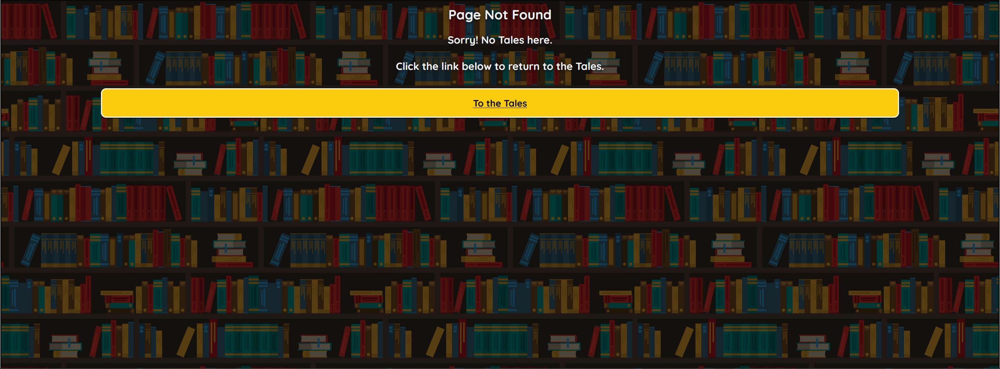

# Mini Tales (Short Story Sharing)

**Developer: Adam Giles**

[Live website](https://mini-tales-project.herokuapp.com/)

## Table of Content

- [Project Goals](#project-goals)
- [User Experience](#user-experience)
    - [Target Audience](#target-audience)
    - [User Stories](#user-stories)
- [Design](#design)
    - [Colour](#colour)
    - [Fonts](#font)
    - [Structure](#structure)
    - [Code Structure](#Code-Structure)
    - [Database](#Database)
- [Technologies Used](#technologies-used)
    - [Languages](#languages)
    - [Frameworks, Libraries & Tools](#frameworks-libraries--tools)
- [Features](#features)
- [Validation](#validation)
    - [HTML Validation](#html-validation)
    - [CSS Validation](#css-validation)
    - [JS Validation](#js-validation)

## Project Goals
Mini Tales is a short story sharing website. Users can create an account to share, read, search for and upvote short stories.

Mini Tales has the following goals;
- Give users a platform to submit and share short stories.
- Give users a platform to search for and read short stories.

Users of Mini Tales have the following goals;
- To create an account to submit short stories.
- To submit short stories for other users to read and upvote.
- To edit or delete their existing short story submissions.
- To search/filter for short stories by keywords.

## User Experience

### Target Audience
- Individuals interested in sharing short stories.
- Individuals interested in reading short stories.

### User Stories
User stories have been separated into two groups; Site Users and Site Owner. 

#### Site Users
1. I would like to create an account to share my short stories with other users.
2. I would like to submit a short story to the website.
3. I would like to edit my short story submission.
4. I would like to delete my short story submission.
5. I would like to search and filter for other user's short stories.
6. I would like to upvote short stories that I enjoy.

#### Site Owner
7. I would like users to have the ability to create a unique account on the website.
8. I would like users to be able to "Log in" to the website.
9. I would like users to be able to "Log out" of the website.
10. I would like the user to be able to search and filter for other user's short stories using keywords.
11. I would like the website to be responsive, so I can be accessed via mobile, tablet and desktop.

## Design

### Colour
The site's colour scheme consists of four key colours; White, black, yellow and red. White is used for input fields and text background. Black is used for text, icons and borders. Yellow is for buttons, links and key information. Red is used for delete buttons and alert messages.

Key Colours

### Font

One font was used on the site; Quicksand, which is a clear and legible font.

### Structure

The website structure consists of the main "Base" page, with the following sections being added to this page dependant on the URL; an "Explore Tales" page, a Log in page, a Register page, a Tale page, a My Tales page, a New Tale page, an Edit Tale page, a Delete Tale page and 404 page.

The pages are detailed below;

Base Page

- This page contains a header; consisting of Site Logo and Navigation Bar (Links change if the user is logged in). Also a footer; consisting of a credits link, disclaimer and copyright notice. 

Explore Tales Page

- This page contains a search bar and a block for each submitted tales. Each block shows all the tales details, except for the tale story. Users can also click the like link when logged in, to like/unlike a tale. A clear search button displays if a search is conducted.

Log in Page

- This page contains a form for the user to complete that will log them into the site.

Register Page

- This page contains a form for the user to complete that will create an account and log them into the site.

Tale Page

- This page displays all the content of a tale for a user to read. If the user is logged in and this tale is theirs, a button to edit/delete the tale is displayed.

My Tales Page

- This page displays all the currently logged in user's tales. A button to edit/delete the tale is displayed on each tales. Also a button is displayed for the user to submit a new tale.

New Tale Page

- This page contains a form for the user to complete that will submit a tale to the site.

Edit Tale Page

- This page contains a form for the user to complete that will allow them to edit an existing submitted tale. Also a button is displayed for the user to delete the tale.

Delete Tale Page

- This page contains buttons for the user to confirm or cancel a deletion request.

404 Page

- A 404 page was created to ensure that a user can easily navigate back to the main site if they encounter a page which does not exist.

### Code Structure
- The website was built using Flask Blueprints; separating the site into smaller parts.
- The website has the following structure;
    - authentication: This folder contains a flask route for authentication, which includes functions for "login", "register" and "logout".
    - tales: This folder contains a flask route for tales, which includes functions for all tale related actions; "get_tales", "clear_search", "my_tales", "newtale", "edittale", "deletetale", "confirmdeletetale", "tale" and "like_tale".
    - static: This folder contains the following sub-folders;
      - css: This folder contains the website's CSS stylesheet.
      - images: This folder contains folders for; "favicon_io"(Website favicon icons) and "readme"  (Images for this README file).
      - js: This folder contains the "validation.js" Javascript file, which is used for the Register page.
    - templates: This folder contains two folders for; the authentication HTML pages and the tales HTML pages. Also the base.html and 404.html files are stored in the templates folder.
    - app.py: This file creates and runs the website application.
    - env.py: This file is used to ensure passwords and security-sensitive information are stored securely in environment variables. This file is added to .gitignore, this file is never committed to the repository.

### Database
- The website is a data-centric website;
- The front-end utilises HTML, Javascript and CSS .
- The backend utilises Python, Flask and Jinja Templates connected with a mongodb document-oriented database.

#### Conceptual Database Model

Conceptual Database Model Image

- To aid with planning the database creation, I started by create a Conceptual Database Model.

#### Physical Database Model

Physical Database Model Image

- After completing the Conceptual Database Model, I created a Physical Database Model. This model reflects the structure of the database on MongoDB.

#### MongoDB Database

Mongo Database Image

- One database called "short_stories" was created to store two collections; 
    - users: This collection stores the user's data.
    - tales: This collection stores each tales's data.

#### Users Collection

Users Collection Image

- When a user creates a new account, a document is created and stored in this collection.
- This collection contains fields for;
    - _id (ObjectId): This is a unique ID that is populated when the document is created.
    - username (String): This is stored in lowercase.
    - password (String): The password is stored encrypted using a generate_password_hash from the werkzeug.security Python library.
    - liked_tales (Array): This stores the Object_IDs of tales the user has "Liked".

#### Tales Collection

Tales Collection Image

- When a user submits a new tale, a document is created and the data is stored in this collection.
- This collection contains fields for;
    - _id (ObjectId): This is a unique ID that is populated when the document is created.
    - tale_title (String): This is the tale's title.
    - tale_blurb (String): This is the tale's blurb.
    - tale_topic (String): This is the tale's topic.
    - tale_content (String): This is the tale's story.
    - tale_likes (Int32): This is the amount of "Likes" the tale has received.
    - tale_views (Int32): This is the amount of Views the tale has received.
    - tale_publish_date (String): This is the date the tale was submitted.
    - tale_author (String): This is the username of the user who submitted the tale.

## Technologies Used

### Languages

- HTML
- CSS
- Javascript
- Python
- Jinja

### Frameworks, Libraries & Tools

- [Am I Responsive](http://ami.responsivedesign.is/), used to create a devices mock-up image. 
- [Balsamiq](https://balsamiq.com/), used to create wireframes.
- [Favicon.io](https://favicon.io), used to create the site favicon.
- [Font Awesome](https://fontawesome.com/), used for all site icons.
- [Git](https://git-scm.com/), used for version control within VSCode to push the code to GitHub.
- [GitHub](https://github.com/), used to store project code.
- [Google Fonts](https://fonts.google.com/), used to acquire the site's font.
- [Lucidchart](http://lucidchart.com), used to create database design diagrams.
- [WC3 Validator](https://validator.w3.org/), [Jigsaw W3 Validator](https://jigsaw.w3.org/css-validator/), [Wave Validator](https://wave.webaim.org/), [Lighthouse](https://developers.google.com/web/tools/lighthouse/) and [Am I Responsive](http://ami.responsivedesign.is/), used to test the site's code, performance, accessibility and responsiveness. 

## Features

The website consists of nine pages with ten features.

### Navigation Bar
- Situated in a persistent position at the top of every page.
- Contains links to the other website pages.
- Available links change if the user is logged into the website;
    - Logged out: "Explore Tales", "Login" and "Register".
    - Logged in: "Explore Tales", "My Tales" and "Log out".
- When hovering over a link on Desktop devices the link colour changes and a bottom border line is shown. This gives visible notification to the user that the link is clickable.
- Meets user stories: 1, 2, 7, 8, 9.

### Search Bar and Clear Search Button
- Situated at the top of the Explore Tales page.
- User's can conduct keyword searches which will then only display tales that contain the keyword.
- The search criteria is maintained when reloading the page and can be cleared with the Clear Search button.
- The Clear Search button is only visible if a search has been conducted.
- Meets user stories: 5, 10.

### Explore Tales Section
- Situated on the Explore Tales page.
- This section displays a "tale block" for each submitted tale (Which tales show depends on any search criteria).
- Each "tale block" contains the Tale's Title, Publish Date, Topic, Blurb, Author, View Count and Like Count.
- The Tale Title can be clicked, which will then take the user to the Tale page, which shows the Tale's Content.
- The Like Count can also be clicked if the User is logged in, which increases/decrease the value by 1 depending on if the user has already liked the tale. The "Heart" icon is coloured red if the user likes the tale, providing visual notification to the user.
- Meets user story: 6.

### My Tales Section
- This page displays a "tale block" for each of the current logged in user's submitted tales.
- Each "tale block" contains the Tale's Title, Publish Date, Topic, Blurb, Author, View Count and Like Count.
- Each "tale block" also has a button at the top to "Edit/Delete Tale". This takes the user to a page where the tale can be edited.
- The Tale Title can be clicked, which will then take the user to the Tale page, which shows the Tale's Content.
- There is a button to "Add a New Tale" which will take the user to a tale submission page.
- Meets user story: 2, 3, 4.

### New Tale Section
- This page contains a form for the user to submit a tale to the website.
- The user completed input fields for the Tale's Title (Text), Topic (Dropdown), Blurb (Textarea) and Your Tale (Textarea).
- The user then clicks a submit button, which adds the tale to the tales database collection.
- The tale title is limited to 30 characters and the blurb to 400.
- Meets user story: 2.

### Edit Tale Section
- This page contains a form for the user to Edit one of their submitted tales.
- The user completed input fields for the Tale's Title (Text), Topic (Dropdown), Blurb (Textarea) and Your Tale (Textarea).
- The above fields are pre-populated with the existing tale data when the page loads
- The user then clicks a submit button, which updates the tale's database collection document.
- The publish date is set to the submission date, The view count to 0 and like count to 0.
- If any other user's have liked the tale, the tale's ObjectId is removed from the liked_tales field for that user.
- The tale title is limited to 30 characters and the blurb to 400.
- There is a button to "Delete this Tale", which takes the user to the Confirm Delete page.
- Meets user story: 3.

### Delete Tale Section
- This page contains text asking if the user is sure they want to delete the tale and two buttons.
- A button for "Yes, Delete this Tale" to delete the tale, when clicked this deletes the tale's database collection document and returns the user to the My Tales page.
- A button to "No, Go Back!", when clicked returns the user to the Edit Tale page
- Meets user story: 4.

### Login Page
- This page contains a form for the user to log in to the website.
- There are two input fields; username and password. Also a button to "Log in"
- Above the input fields, there is text("New Here?") and a link ("Register and Account") to the Register page.
- The form validation is conducted on the authentication/route.py, which checks the user database collection for a username and password match.
- A flashes message appears at the top of this section if validation fails.
- Meets user story: 8.

### Register Page
- This page contains a form for the user to create an account on the website.
- There are three input fields; username, password and confirm password. Also a button to "Create and Account"
- Above the input fields, there is text("Register below to share your Tales with other Mini Tales users").
- Validation is conducted on both the authentication/route.py and the validation.js script.
- The validation.js validation checks if the input field entries meet their corresponding Regular Expression, also that the both password fields match. The form will not submit if this validation fails.
- When the above validation completes, the authentication/route.py validation checks the users database collection to make sure the username does not already exists.
- A flashes message appears at the top of this section if authentication/route.py validation fails.
- A validation alert message appears at the top of this section if validation.js validation fails.
- Meets user story: 1, 7.

### 404 Page
- This page is display when a user encounters a page that does not exist (HTTP 404 response code).
- The user is provided with a link to return to the Explore Tales page.

## Validation

### HTML Validation

W3C Markup Validation Service was utilised to validate the HTML of the website. The website's pages passes with no errors.

Website

### CSS Validation

W3C Jigsaw CSS Validation Service was utilised to validate the website's CSS. When validating the website, 0 errors are found.

Website

### JS Validation

JSHint was utilised to validate the website's JS. 0 errors are found. 

validation.js

## Testing

### Accessibility

WAVE WebAIM web accessibility evaluation tool was utilised to ensure the website met accessibility standards, passed with 0 errors.

Accessibility Test Result

